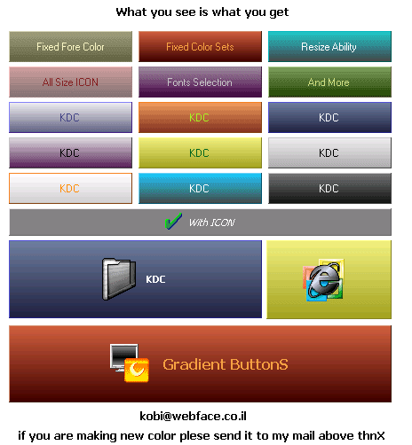



## A \- Gradient Button

### Description

Gradient Button with nice color sets

the color sets are placed in the OCX

and can be modified from the code

Please vote for this code also you can add icon

to the button ,and all the min property

the color part is like i have seen in pscode

msgbox somewhere so thanks to stephan

swertvaegher that

did that part.....VIEW SCREEN SHOT
 
### More Info
 

             |
---                |---
**Submitted On**   |2001-09-08 00:13:48
**By**             |[KDC](https://github.com/Planet-Source-Code/PSCIndex/blob/master/ByAuthor/kdc.md)
**Level**          |Intermediate
**User Rating**    |5.0 (30 globes from 6 users)
**Compatibility**  |VB 6\.0
**Category**       |[OLE/ COM/ DCOM/ Active\-X](https://github.com/Planet-Source-Code/PSCIndex/blob/master/ByCategory/ole-com-dcom-active-x__1-29.md)
**World**          |[Visual Basic](https://github.com/Planet-Source-Code/PSCIndex/blob/master/ByWorld/visual-basic.md)
**Archive File**   |[A \- Gradie26087972001\.zip](https://github.com/Planet-Source-Code/kdc-a-gradient-button__1-27054/archive/master.zip)

